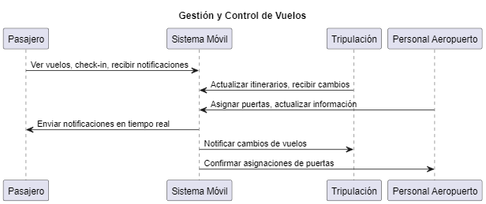

## HU1: Comprensión del Problema

### Diagrama de Proceso

**Descripción:**

El siguiente diagrama representa la interacción entre los principales actores (pasajeros, tripulación y personal del aeropuerto) con el sistema móvil de gestión y control de vuelos:

```
                +------------------+
                |  Sistema Móvil   |
                +------------------+
                          |
         +----------------+-----------------+
         |                                  |
+------------------+         +-------------------+
|     Pasajeros     |         |    Personal Aero. |
+------------------+         +-------------------+
         |                                  |
    Ver vuelos, check-in                Asignar puertas,
    recibir notificaciones              actualizar info
         |
+------------------+         +-------------------+
|   Tripulación    |---------|  Comunicación     |
+------------------+         +-------------------+
         |
    Actualizar itinerarios,
    recibir cambios
```


### Explicación Breve

El diagrama ilustra cómo el sistema móvil centraliza las interacciones entre pasajeros, tripulación y personal del aeropuerto. Los pasajeros pueden verificar vuelos, realizar check-in y recibir notificaciones. La tripulación actualiza itinerarios y recibe cambios en tiempo real, mientras que el personal del aeropuerto gestiona asignaciones de puertas y otras operaciones. Todo está conectado a través del sistema móvil, asegurando una comunicación fluida.

### Modelo Relacional

**Tablas propuestas:**

- **Vuelos** (id\_vuelo, origen, destino, hora\_salida, hora\_llegada, estado)
- **Pasajeros** (id\_pasajero, nombre, apellido, email, telefono)
- **Reservas** (id\_reserva, id\_pasajero, id\_vuelo, asiento, estado)
- **Tripulación** (id\_tripulante, nombre, apellido, rol, id\_vuelo)
- **Notificaciones** (id\_notificacion, id\_vuelo, mensaje, fecha\_hora)
- **Puertas** (id\_puerta, numero\_puerta, id\_vuelo, estado)

### Normalización a 3NF

**1NF:**

- Todas las tablas tienen valores atómicos.

**2NF:**

- Todas las columnas dependen completamente de las claves primarias.

**3NF:**

- No hay dependencias transitivas entre atributos no clave.

**Justificación:** Se eliminan redundancias al separar tablas específicas para notificaciones, reservas y puertas. Cada tabla tiene su clave primaria y las relaciones se gestionan mediante claves foráneas.


